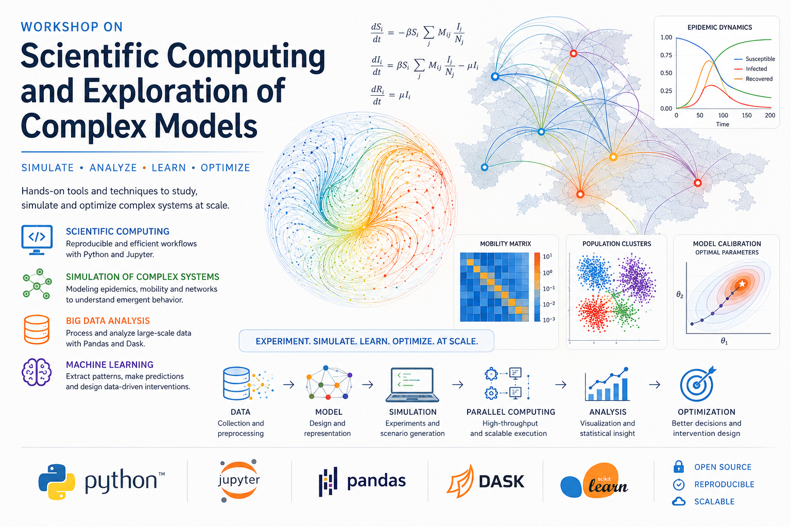

::: {.lead}
## Introductions

This is the full material dor the intensive hands-on introduction to scientific computing, data analysis, large-scale simulations, and computational model exploration using modern Python tools.
:::

---

## Course Topics

::: {.grid}

::: {.g-col-6}
### Data Analysis

- Pandas & DataFrames
- Xarray
- Large-scale datasets
- Visualization
- Reproducible workflows
:::

::: {.g-col-6}
### Computational Modeling

- Computer simulations
- Parallel computing
- Model calibration
- Evolutionary algorithms
:::

:::

---

## Course Material

::: {.grid}

::: {.g-col-6}
### Lecture Slides

Interactive lecture presentations covering the theoretical foundations and computational methods.

[Open Lectures](lectures.html){.btn .btn-primary}
:::

::: {.g-col-6}
### Practical Sessions

Hands-on notebooks and exercises using Python and Jupyter.

[Open Practicals](practicals.html){.btn .btn-success}
:::

:::

---

## Tools & Libraries

::: {.grid}

::: {.g-col-3}
- Python
- Jupyter
- NumPy
- Pandas
:::

::: {.g-col-3}
- Xarray
- Dask
- Polars
- Matplotlib
:::

::: {.g-col-3}
- Scikit-learn
- CMA-ES
- HPC
- Parallel Computing
:::

::: {.g-col-3}
- Simulation
- Workflow Systems
- Model Exploration
- Reproducibility
:::

:::

---

## Learning Goals

By the end of the course, students will be able to:

- Use modern Python tools for scientific computing.
- Process and analyze scientific datasets efficiently.
- Develop reproducible computational workflows.
- Run and analyze large-scale simulations.
- Apply parallel computing strategies.
- Explore and calibrate computational models.

---

## Audience

The course is intended for advanced undergraduate and graduate students in quantitative disciplines such as:

- Biology
- Physics
- Engineering
- Data Science
- Computational Social Science

Basic Python knowledge and Linux command line usage is strongly recommended, but prior HPC experience is not required.