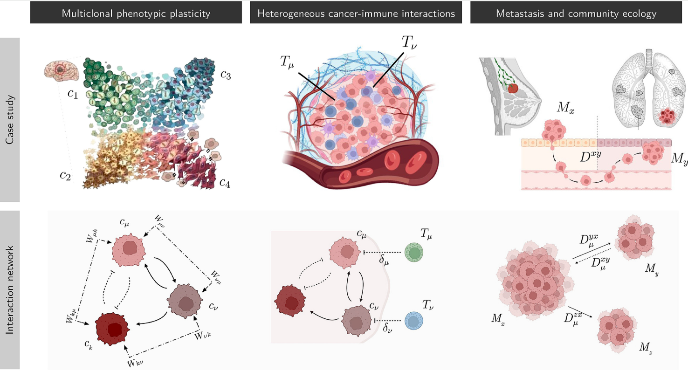
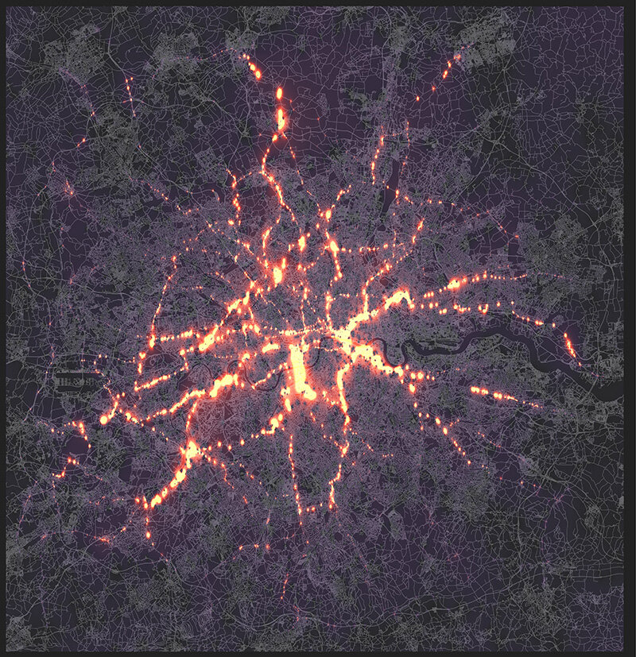
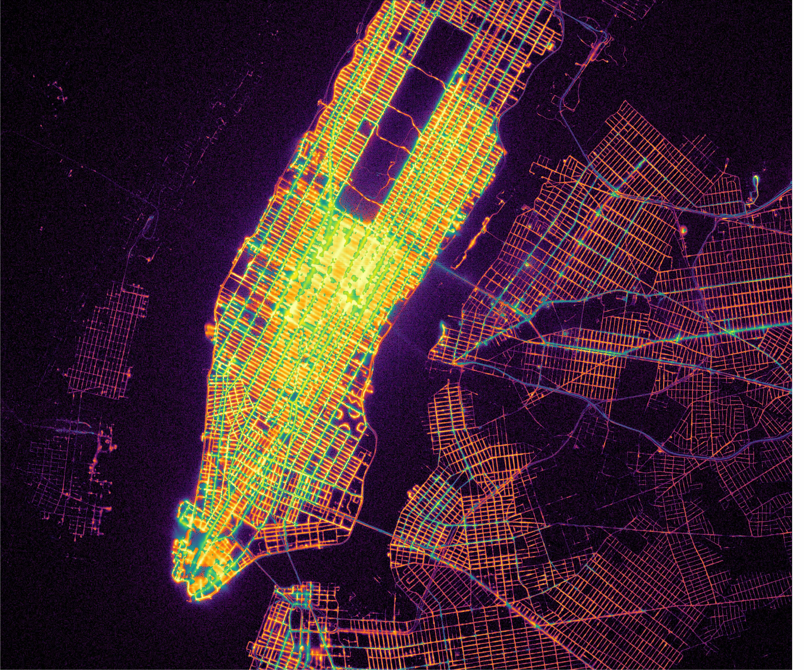
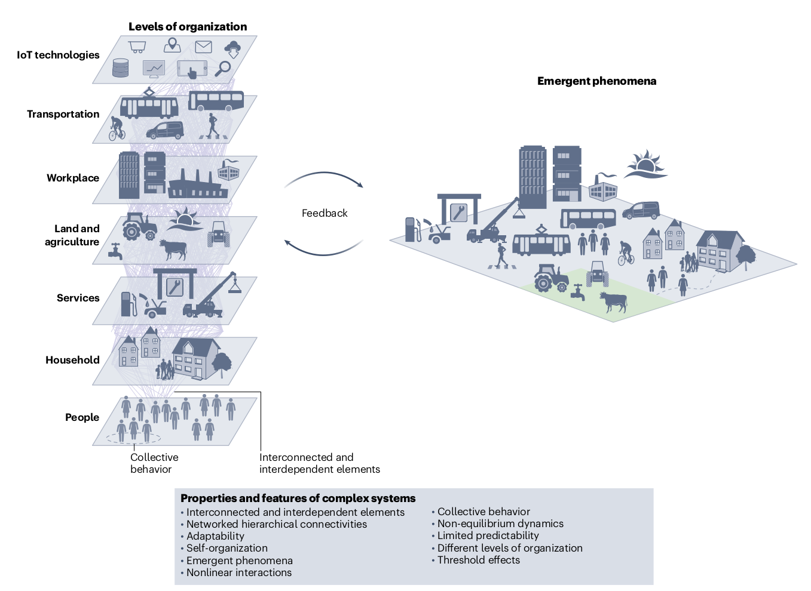
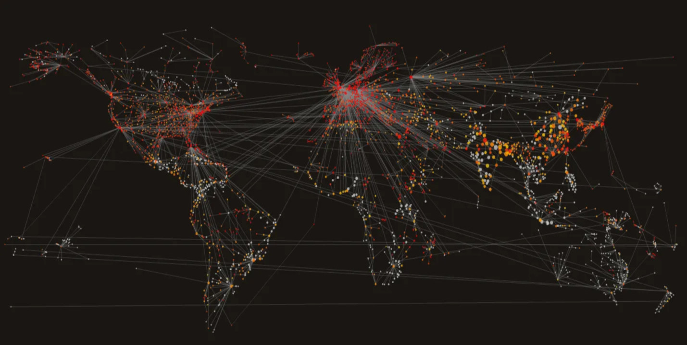
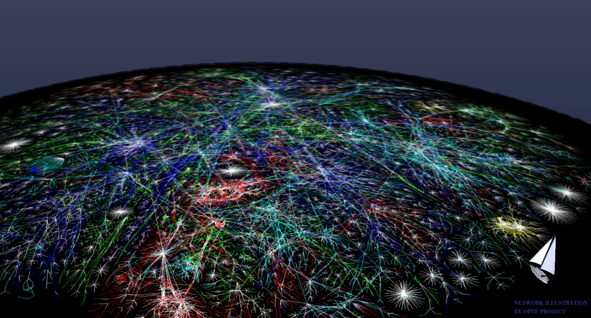

## Motivación

El estudio de sistemas complejos es fundamental para entender fenómenos en diversas áreas, como:

- Dinámica de epidemias  
- Crecimiento y evolución de tumores  
- Las ciudades 

 ¿Cómo entendemos y predecimos estos sistemas?

---

## Sistemas complejos (I)

Un sistema complejo es un sistema compuesto por muchos componentes que interactúan entre sí  [1].

**Ejemplos:**

- Clima
- Organismos
- Ecosistemas
- Infraestructuras (red eléctrica, transporte)
- Organizaciones sociales y económicas (como las ciudades )

::: {.footer}
[1] <https://en.wikipedia.org/wiki/Complex_system>
:::

---

## El cancer como un sistema complejo adaptativo {.figure-slide}

::: {.content} 

:::

::: {.footer}
Source: Aguadé-Gorgorió G, Anderson A, Solé R. Modeling tumors as complex ecosystems iScience, 2024; 27
:::

---

## Mobilidad urbana {.figure-slide}

::: {.content}

::: columns
::: column
El tráfico en Londres  

:::

::: column
Taxistas en Nueva York  

:::
:::

:::

::: {.footer}
Sources: 
[1] https://phys.org/news/2019-03-laws-physics-untangle-traffic-stock.html 
[2]https://medium.com/data-science/new-york-city-taxi-data-visualization-eda-1c8e9b0a7c5
:::

---

## Las ciudades como sistemas complejo adaptativos {.figure-slide}

::: {.content} 

:::

::: {.footer}
Source: Caldarelli, G et al. The role of complexity for digital twins of cities. Nat Comput Sci (2023)
:::

---

## ¿Como se propagan las epidemias? {.figure-slide}

::: {.content} 
{width=1080px}
:::

::: {.footer}
Source: https://www.wired.com/2015/04/see-diseases-spread-mesmerizing-graphics/
:::

---

## ¿Como se difunde la información en la WWW? {.figure-slide}

::: {.content} 

:::

::: {.footer}
Source: https://www.wired.com/2015/04/see-diseases-spread-mesmerizing-graphics/
:::

---

## Sistemas complejos (II)

**Algunas propiedades**

- No lineales  
- Multi-escala  
- Propiedades emergentes
- Adaptativos  

**Ejemplos:**

- dinámica de un ecosistema  
- crecimiento tumoral
- propagación epidémica
- las ciudades

---

## La revolución de los datos

La terória de sistemas complejos se ha desarrollado durante décadas, pero en los últimos años ha habido una revolución:

**Ha aumentado exponencialmente**

- La disponibilidad de datos (de todo tipo)
- La capacidad de procesamiento y almacenamiento

Esto ha transformado la forma en que estudiamos los sistemas complejos

---

## Tipos de datos en ciencia

Trabajamos con distintos tipos de datos:

- Series temporales  
- Datos espaciales (geográficos)  
- Imágenes  
- Datos ómicos  
- Datos de sensores  
- Redes (interacciones)  

Cada tipo de dato tiene **estructura** propia

---

## Datos estructurados vs no estructurados

### Estructurados
- organización clara  
- dimensiones definidas  
- ejemplos:
  - tablas
  - series temporales
  - matrices

---

### No estructurados
- texto
- imágenes sin procesar
- audio

En este curso nos centraremos en datos estructurados

---

## Dos enfoques en el estudio de sistemas complejos

**El problema:** Tenemos datos... pero también queremos entender el sistema para poder simular escenarios futuros o evaluar intervenciones.

::: columns
::: column
**Enfoque inductivo (data-driven)**  
- basado en datos
- estadistica descriptiva  
- machine learning
- caja negra
:::

::: column
**Enfoque deductivo (model-driven)**  
- basado en hipótesis  
- inferencias causales
- modelos mecanísticos
- simulación
:::
:::

---

## Enfoque inductivo

- Basado en datos  
- Machine learning  
- Predicción  
- Reconocimiento de patrones

**Ejemplos:**

- predicción de nuevos casos (forecasting)  
- clasificación (prediccion de tratamientos)

---

## Enfoque deductivo

- Basado en hipótesis  
- Modelos mecanísticos  
- Simulación  

**Ejemplos:**

- modelos SIR  
- modelos celulares
- modelos de agentes  

---

## Limitaciones

**Machine learning**
- Necesita muchos datos  
- Difícil de interpretar  
- El problema de la generalización

**Modelos**
- Parámetros desconocidos  
- Simplificaciones  
- Dificultad para ajustarse a datos reales
- Validación

---

## Convergencia

Existe una convergencia entre ambos enfoques:

- Simulation-based inference  
- Surrogate models  
- Neural ODEs  

Estos enfoques combinan la capacidad de los modelos para representar mecanismos con la capacidad de los datos para ajustar y validar esos modelos.

---

## Gemelos digitales

Modelo + datos + actualización continua

Ejemplos:

- sistemas biológicos  
- epidemias  
- ciudades 
- Industria 

---

## Estructura del curso

Módulo 1:
- Procesamiento de datos

Módulo 2:
- Simulación de sistemas complejos

Módulo 3:
- Exploración de modelos e inferencia

---

## Metodología

- Clases teórico-prácticas
- Un caso de estudio común durante todo el curso:
    - Movilidad y epidemias
    - Datos espacio-temporales (masivos)
- Trabajo progresivo hacia un proyecto final

---

## Evaluación

Proyecto individual:

- Definición del problema
- Diseño del experimento
- Implementación
- Análisis de resultados
- Informe final reproducible

---

## Herramientas (Python ecosystem)

**Datos**
- pandas, polars, dask, pyarrow, xarray

**Modelado**
- numpy, xarray, scipy  

**Visualización**
- seaborn, matplotlib  

**Machine learning**
- scikit-learn, statsmodels  

**Entorno**
- Jupyter notebooks / JupyterLab

---

## Datos y modelos del curso

Trabajaremos con datos espacio-temporales:
- Matrices de movilidad  
- Series temporales (incidencia)  
- Mapas y capas geográficas  
- Simulaciones de epimdemias

Datos reales y simulados

---

## Objetivo

Construir un pipeline completo:

datos → simulación → análisis → exploración → inferencia

---

## ¿Qué haremos hoy?

- Trabajar con datos reales:
    - Datos de COVID-19 en España
    - Datos de movilidad basados en teléfonos móviles
- Explorar y procesar datos  
- Realizar algunos análisis básicos  

---

## Transición a práctica

Empezamos con datos observados

---

## Datos de movilidad

En esta segunda parte trabajaremos con datos de movilidad poblacional.

Estos datos describen el número de viajes entre zonas geográficas en España.

Cada fila del dataset representa:

- un origen
- un destino
- una fecha
- y un número de viajes

Al igual que los datos de COVID, estos datos están segmentados por distintas dimensiones:

- grupo de edad
- distancia recorrida
- tipo de actividad (origen/destino)

Por tanto, **no representan directamente los flujos totales entre regiones**

---

## Problema

Queremos construir una representación más simple:

una matriz origen-destino (OD)

Para ello, necesitaremos:

- entender la estructura de los datos  
- agregar correctamente  
- interpretar el resultado  

---

## Conexión con sistemas complejos

Estos datos pueden interpretarse como:

- una red dinámica  
- donde los nodos son regiones  
- y las aristas representan flujos de personas  

Esta red será clave para modelar la propagación de enfermedades