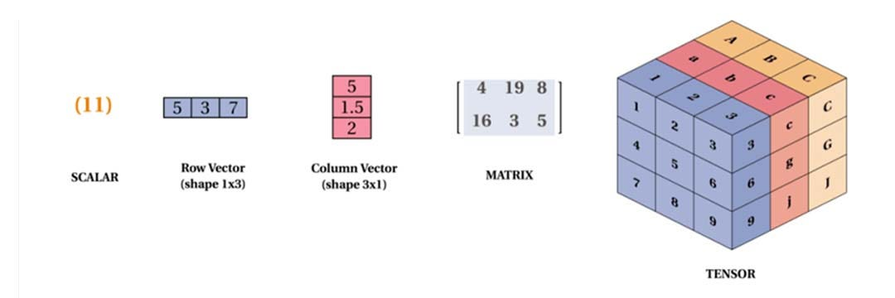
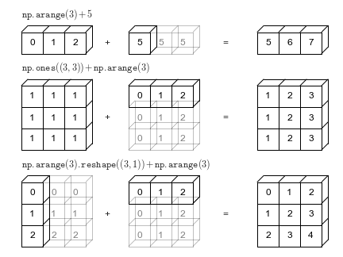
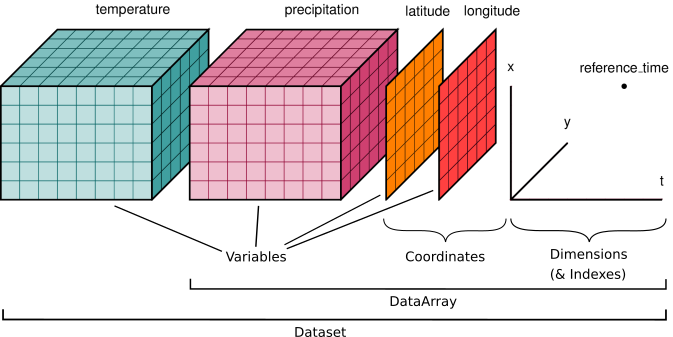

## Datos científicos ≠ tablas

Muchos problemas científicos tienen estructura en múltiples dimensiones:

- tiempo  
- espacio  
- variables  

**Ejemplos:**

- epidemiología: región × tiempo × edad × variable (casos, muertes, etc)  
- movilidad: origen × destino × tiempo  ... 
- simulaciones: espacio × tiempo × estado  ...

Estos datos **NO** son naturalmente tabulares

---

## Dataframe (formato largo)

#### Representación de la incidencia 

| date | region | age   | sex  |cases |
|------|--------|-------|------|------|
| t1   | A      | 26-35 |   M  |  35  |
| t1   | A      | 26-35 |   H  |  39  |

#### Representación de la movilidad

| date | origin | destination | flow |
|------|--------|-------------|------|
| t1   | A      | B           | 100  |
| t1   | A      | C           | 50   |

**¿Dónde está la estructura?**

---

## Problema con dataframes

Para representar datos multidimensionales:

- duplicamos filas (cada combinación)
- usamos joins para combinar datos
- alineamos manualmente

Esto introduce complejidad, errores y dificula el análisis y la escalabilidad

---

## Problema con dataframes

### Ejemplo real

Para calcular riesgo:

- calcular densidad de casos:
    - (casos(t, i) / población(i))
- merge movilidad + densidad de casos (alinear por fecha y región)
- multiplicar por flujo de movilidad (flow(t, i, j)) por densidad
    - riesgo(t, i, j) = flow(t, i, j) · density(t, i)
- repetir para cada fecha t

**Conlusión:** código complejo para algo simple (poco escalable)

---

## Idea clave

La estructura del dato debe reflejar la estructura del problema

### Array

flow(t, i, j)

La estructura es explícita

- dimensión tiempo  
- dimensión origen  
- dimensión destino  

---

## Arrays multidimensionales

Un array es una colección de valores organizados en una estructura regular.

**Dependiendo de la cantidad de dimensiones:**

- 0D → escalar
- 1D → vector  
- 2D → matriz  
- nD → tensor  

:::footer
Figure source: <https://medium.com/@fathahka/scalar-vector-matrix-tensor-in-linear-algr-f1bc673fa4eb>
:::

---

## Notación

Un tensor de dimensión $n$ se denota como:

$X \in \mathbb{R}^{d_1 \times d_2 \times \cdots \times d_n}$

donde $d_i$ es la dimensión $i$-ésima

**Ejemplo: matriz origen-destino**

$X(t, i, j)$: tensor de dimensión 3 con dimensiones:

- t → tiempo: ${t_1, t_2, ..., t_T}$
- i → origen: ${i_1, i_2, ..., i_M}$
- j → destino: ${j_1, j_2, ..., j_M}$

---

## Dimensiones

Las dimensiones definen la estructura del array:

- **tiempo**: $t \in \lbrace t_1, t_2, ..., t_T \rbrace$  
- **región**: $i \in \lbrace i_1, i_2, ..., i_M \rbrace$  
- **origen/destino**: $j \in \lbrace j_1, j_2, ..., j_M \rbrace$
- **sexo**: $s \in \lbrace M, H \rbrace$
- etc  

Cada dimensión tiene un significado específico y puede ser manipulada de forma independiente

---

## Operaciones básicas en arrays: indexado

Los índices permiten acceder a los valores específicos dentro del array

Acceder a un elemento:

- **Notación matemática:** $X(t, i, j)$ o $X_{t, i, j}$
- **Notación en código:** `X[t, i, j]`

Seleccionar un subconjunto (**slice**):

`X[t, :, :]` → todos los orígenes y destinos en el tiempo $t$

Los índices pueden entenderse como **coordenadas** en un espacio multidimensional

---

## Operaciones básicas en arrays: Transposición (I)

La transposición es una operación que reordena las dimensiones de un array. 

En el caso de una matriz (2D), la transposición intercambia filas por columnas.

::: columns

::: column
**Matriz original (2×3)**

$A = \begin{bmatrix}
1 & 2 & 3 \\
4 & 5 & 6
\end{bmatrix}$

:::

::: column
**Matriz transpuesta (3×2)**

$A^T =
\begin{bmatrix}
1 & 4 \\
2 & 5 \\
3 & 6
\end{bmatrix}$

:::

:::

## Operaciones básicas en arrays: Transposición (II)

En *nd*-arrays, la transposición puede reordenar cualquier combinación de dimensiones.

- $X(t, i, j)$ → $X(t, j, i)$
- En código: `X.transpose(0, 2, 1)`

**Ejemplo:**

::: columns

::: column
**Array original $X(t, i, j)$**

$X =
\begin{bmatrix}
\begin{bmatrix}
1 & 2 \\
3 & 4
\end{bmatrix}
,
\begin{bmatrix}
5 & 6 \\
7 & 8
\end{bmatrix}
\end{bmatrix}
$

Dimensiones: $(t, i, j)$
:::

::: column
**Transposición $X^T$**

$X^T =
\begin{bmatrix}
\begin{bmatrix}
1 & 3 \\
2 & 4
\end{bmatrix}
,
\begin{bmatrix}
5 & 7 \\
6 & 8
\end{bmatrix}
\end{bmatrix}
$

Dimensiones: $(t, j, i)$
:::
:::
<small>**Importante:** la transposición reordena las dimensiones de un array</small>

---

## Reorganización de dimensiones (`reshape`)

A veces necesitamos:

- cambiar orden de dimensiones
- añadir/eliminar dimensiones

El `reshape` permite cambiar la forma del array sin modificar los datos (e.g. convertir una matriz esparsa en una matriz densa)

**Ejemplo:** (10, 5) → (5, 10)

El `flatten` convierte un array multidimensional en un vector (útil para machine learning y almacenamiento):

**Ejemplo:**  (10, 5) → (50,) 
 
---

## Reducciones

Operaciones sobre dimensiones específicas:

- suma  
- media  
- máximo  

**Ejemplos**

$\sum_j X(t, i, j)$ → nº total de viajes saliente desde $i$

`X.sum(axis=2)` → en código

$\frac{1}{N} \sum_j X(t, i, j)$ → promedio saliente desde $i$

`X.mean(axis=2)` → en código

---

## Producto elemento a elemento (product wise)

Nos sirve para combinar información de dos arrays con la misma forma (shape)

Y(t, i, j) = A(t, i, j) · B(t, i, j)

**Ejemplo: casos normalizados por población**

- Los caso tiene dimensión $t \times i$ y la población tiene dimensión $i$, donde $t$ es la fecha (o tiempo) e $i$ es la región. 
- Para obtener casos por población, necesitamos dividir cada elemento de casos por el elemento correspondiente de población
- casos(t) por 100.000 habitantes = casos(t) / población

Pero, ¿que pasa si los arrays tienen dimensiones distintas?

---

## Broadcasting

Permite combinar datos con distinta dimensionalidad sin necesidad de reestructurar explícitamente

Esto se logra extendiendo automáticamente las dimensiones más pequeñas para que coincidan con las más grandes

**Ejemplo: riesgo asociado a la movildiad**

- flow(t, i, j)  (viajes entre $i$ y $j$ en el tiempo $t$)
- density(t, i) (casos activos en $i$ por población en el tiempo $t$)

**Resultado:**

risk(t, i, j) = flow(t, i, j) · density(t, i)

---

## Broadcasting {.figure-slide}

::: {.content}
 
{width=800px}

:::

::: {.footer}
Source: https://jakevdp.github.io/PythonDataScienceHandbook/
:::

---

## Broadcasting: reglas

La difusión de datos en NumPy sigue un conjunto estricto de reglas para determinar la interacción entre dos arreglos:

1. Si los dos arreglos difieren en su número de dimensiones, el arreglo con menos dimensiones se rellena con unos en su lado izquierdo.

2. Si el tamaño de los dos arreglos no coincide en ninguna dimensión, el arreglo con un tamaño igual a 1 en esa dimensión se expande para que coincida con el otro.

3. Si en alguna dimensión los tamaños no coinciden y ninguno es igual a 1, se genera un error.

<small>De momento no entraremos en detalles, pero es importante saber que existen estas reglas</small>

---

## Comparación

::: columns

::: column
**Dataframes**

- estructura implícita
- operaciones indirectas
- joins necesarios

<small>tabla larga → difícil de razonar</small>

:::

::: column

**Arrays**

- estructura explícita  
- operaciones directas  
- broadcasting  

<small>estructura explícita → fácil de razonar</small>
 
:::
:::

Además los arrays se almacenan de forma contigua en memoria lo que permite realizar:

- operaciones rápidas
- vectorización

---

## Representación del problema

Elegir cómo **representamos** los datos:

- define cómo pensamos  
- define qué errores cometemos  
- define qué código escribimos

<small>importante para escribir código más claro y con menos errores</small>

**Coordenadas**. Cada dimensión tiene valores asociados:

- tiempo → fechas  
- región → nombres  
- edad → rangos  

<small>Esto convierte índices en información interpretable!</small>
 

---

## Problema

Los arrays de NumPy:

- usan índices numéricos  
- no tienen etiquetas  
- son propensos a errores  

`X[3, 5, 2]` ¿qué significa 3? 

- ¿fecha?
- ¿región?

no lo sabemos, y es fácil confundir el orden de las dimensiones. `X[3, 5, 2]` es difícil de interpretar y propenso a errores.

---

## Errores comunes

- confundir dimensiones
- asumir orden incorrecto
- perder estructura al transformar
- escribir código complejo para manejar estas confusiones

---

## Índices vs coordenadas

En NumPy:

X[3, 5, 2]

no sabemos qué significa cada dimensión

En problemas reales:

- t = "2020-03-15"  
- i = "Madrid"  
- j = "Barcelona"  

necesitamos coordenadas con significado

---

## La solución

### Necesitamos

- arrays multidimensionales  
- con significado semántico  

Es decir, necesitamos:

- dimensiones con nombre  
- índices con etiquetas  

:::{.center .middle}
**Esto es xarray!!**
:::

---

## Que es Xarray?

- es una biblioteca de Python para trabajar con <u>arrays multidimensionales etiquetados</u>.
- introduce etiquetas en forma de dimensiones, coordenadas y atributos sobre matrices multidimensionales (similares a NumPy)
- permite una experiencia de desarrollo más intuitiva, concisa y con menos errores.

**Proporciona:** 

- `DataArray` que combina la eficiencia de los arrays de numpy con la flexibilidad de las etiquetas.
- `Dataset` que es una colección de `DataArrays` con dimensiones compartidas.

---

## Xarray: estructuras de datos{.figure-slide}

::: {.content}
 
 
{width=1080px}

:::

::: {.footer}
Source: https://xarray.dev/
:::

---

## Xarray ecosystem {.figure-slide}

::: {.content}
 

:::

::: {.footer}
Source: https://xarray.dev/
:::

---

## Problema: almacenamiento de datos multidimensionales

¿Cómo guardamos:

- flow(t, i, j)

en un fichero?

**CSV:**

- no tiene dimensiones  
- pierde estructura  
- difícil de reconstruir  

**no es es un formato adecuado**

---

## Formatos multidimensionales

**Formatos diseñados para arrays:**

- NetCDF  
- HDF5  
- Zarr  

**Permiten:**

- almacenar dimensiones  
- guardar coordenadas  
- acceder parcialmente a los datos  

---

## NetCDF

Formato utilizado para el almacenamiento y procesamiento de grandes cantidades de datos, especialmente en meteorología y ciencias de la tierra.

Sus características son:
<small>

- **Autodescribiente:** contiene una descripción de su contenido.
- **Portable:** es accesible por sistemas operativos con diferentes maneras de almacenar enteros, caracteres y números de punto flotante.
- **Escalable:** subconjuntos de grandes bases de datos son accesibles incluso desde máquinas remotas.
- **Complementable:** datos nuevos pueden ser agregados sin modificaciones extremas a los datos anteriores de un archivo.
- **Compartible:** mientras un editor agrega datos otros varios editores del archivo pueden continuar su lectura de datos.
- **Compatible:** la compatibilidad con versiones anteriores será conservada.

</small>

---

## Xarray y NetCDF

**Xarray** trabaja directamente con **NetCDF**:

- leer datasets  
- manipular arrays  
- guardar resultados  

**Entonces la integración directa**

---

## Parte práctica

El objetivo de la parte práctica es aplicar los conceptos vistos en clase a un problema real.

Trabajaremos con datos de:

- movilidad poblacional  
- epidemiología  

---

## Estructura de la práctica

La práctica se divide en dos partes:

1. Warm-up con xarray  
2. Caso de estudio del curso  

---

## Parte I — Warm-up

Introducción práctica a xarray utilizando ejemplos simples.

**Objetivos:**

- entender DataArray y Dataset  
- trabajar con dimensiones y coordenadas  
- aprender operaciones básicas  
- introducir broadcasting  

---

## ¿Por qué un warm-up?

xarray introduce una forma distinta de trabajar con datos.

Antes de aplicarlo a un problema real, necesitamos:

- familiarizarnos con la sintaxis  
- entender los conceptos básicos  
- evitar errores comunes  

<small>En esta parte vamos a introducir las ideas básicas de xarray con ejemplos simples,
y luego las aplicaremos a nuestro problema real.</small>

---

## Parte II — Caso de estudio

Aplicaremos **xarray** a un problema real:

- datos de movilidad  
- datos epidemiológicos  

**Objetivo**

Calcular un indicador de riesgo asociado a la movilidad:

- incidencia 10 días
- densidad
- broadcasting
- risk(t, i, j) = flow(t, i, j) · density(t, i)

---

## Flujo de trabajo

1. Convertir dataframes → xarray  
2. Definir dimensiones y coordenadas  
3. Aplicar broadcasting  
4. Calcular métricas
5. Guardar dataset
6. Cargar dataset

---

## ¿Qué cambia respecto a pandas?

En lugar de:

- merges  
- groupby  
- alineación manual  

Trabajaremos con:

- arrays multidimensionales  
- operaciones directas  

---

## Resultado esperado

Al finalizar la práctica serás capaz de:

- trabajar con datos multidimensionales  
- usar xarray de forma efectiva  
- simplificar problemas complejos mediante una mejor representación  

