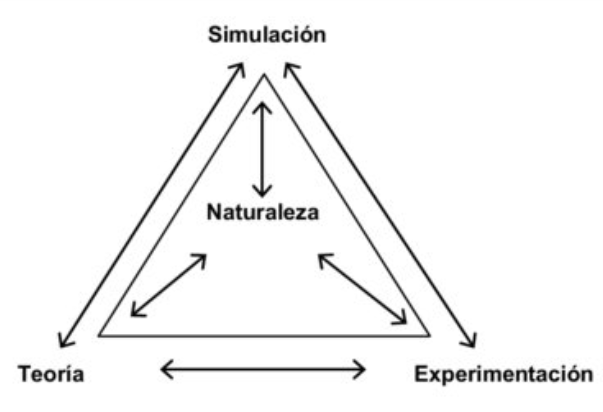

## Motivación

* ¿Podemos hacer ciencia sin tocar el mundo físico?
* Sistemas donde experimentar directamente es:

  * Costoso
  * Peligroso
  * Imposible

> La simulación permite experimentar con modelos del mundo.

---

## ¿Qué es una simulación?

Una simulación es una representación computacional de un sistema que evoluciona en el tiempo.

**Permite:**

- explorar dinámicas complejas  
- evaluar escenarios  
- probar hipótesis  

Ejecutamos el modelo en lugar de observar el sistema real

---

## ¿Qué es un experimento *in silico*?

* Experimento realizado sobre un **modelo computacional**
* Se manipulan variables bajo condiciones controladas
* Se observan resultados como si fueran mediciones

Comparación:

* *In vivo*: en organismos vivos
* *In vitro*: en laboratorio
* *In silico*: en computadora

---

## La simulación como tercer pilar

* Teoría → ecuaciones
* Experimento → observación
* Simulación → integración de ambos

> Permite explorar sistemas donde teoría o experimento son insuficientes.


---

## Más allá del binomio teoría-eperimento




> Las simulaciones por computador supusieron un nuevo enfoque epistemológico

:::footer
Jorge Wagensberg (1985). Ideas sobre la complejidad del mundo
:::

---

---

## Componentes de un experimento *in silico*

* **Modelo**: representación matemática o lógica
* **Parámetros**: constantes ajustables
* **Condiciones iniciales**
* **Intervenciones**
* **Observables**

---

## Analogía con laboratorio

| Experimento real | Simulación |
| ---------------- | ---------- |
| Reactivos        | Parámetros |
| Protocolo        | Algoritmo  |
| Medición         | Salidas    |

---

## Tipos de simulación

### Mecanicistas

* Basados en mecanismos conocidos
* Ej: ODEs, agentes

### Basados en datos

* Machine learning
* Modelos sustitutos

---

## Tipos de simulación (estructura)

### Continuas
- ecuaciones diferenciales (ODEs, PDEs)

### Discretas
- eventos
- agentes

### Deterministas
### Estocásticas

---

## Determinista vs Estocástico

* Determinista: mismo input → mismo output
* Estocástico: incluye aleatoriedad

> Importante para capturar variabilidad biológica

---

## Caso de estudio: epidemias

* Modelos SIR
* Simulación de intervenciones
* Escenarios contrafactuales

Pregunta:

> ¿Qué hubiera pasado sin intervención?

---

## Caso de estudio: biología de sistemas

* Redes regulatorias
* Modelos metabólicos
* Interacción entre niveles

---

## Ejemplo — Epidemias

Podemos modelar:

- dinámica temporal (SIR)
- propagación espacial (metapoblación)
- comportamiento individual (ABM)

> mismo fenómeno, distintos modelos

---

## Representación computacional

Los modelos generan datos estructurados:

- tiempo
- espacio
- variables

Ejemplo:

I(t, i) → infectados por región

> estos datos son arrays multidimensionales

---

## Una simulación como función

Un modelo puede verse como:

```
output = f(parámetros, condiciones iniciales)
```

> ejecutamos f muchas veces

---

## ¿Por qué usar simulaciones?

* Explorar lo imposible
* Bajo costo
* Alta escalabilidad
* Reproducibilidad

> Un experimento se convierte en miles.

---

## Limitaciones

* Suposiciones del modelo
* Incertidumbre en parámetros
* Validación limitada

> "Todos los modelos están equivocados, pero algunos son útiles"

---

## Flujo de trabajo

1. Definir pregunta
2. Construir modelo
3. Calibrar
4. Validar
5. Experimentar
6. Analizar resultados

> Proceso iterativo

---

## Diseño de experimentos *in silico*

* Hipótesis claras
* Controles
* Reproducibilidad
* Exploración sistemática

Explorar:

- parámetros
- escenarios
- incertidumbre

---

## Ejemplo conceptual

* Reducir tasa de infección
* Observar curva epidémica

Pregunta:

> ¿Cómo cambia el pico?

---

## Coste computacional

Simular sistemas complejos:

- muchas variables
- muchos parámetros
- muchas ejecuciones

> requiere computación eficiente

---

## Reflexión

* ¿Aprendemos del modelo o del mundo?
* ¿Qué significa validar una simulación?

---

## Conclusión

* La simulación es una herramienta científica clave
* Complementa teoría y experimento
* Requiere pensamiento crítico

---

## Discusión

* Preguntas
* Ideas
* Aplicaciones en su área
