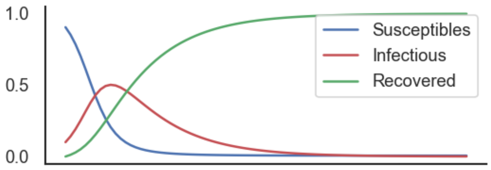

## Modelo SIR clásico
<hr>

- Divide la población en tres compartimentos:

  - $S$: susceptibles  
  - $I$: infectados  
  - $R$: recuperados  

- Población total constante:

$$
N = S + I + R
$$

---

## Dinámica del modelo SIR
<hr>
{width=680px}
<hr>

$\frac{dS}{dt} = -\beta \frac{S I}{N}$

<br>

$\frac{dI}{dt} = \beta \frac{S I}{N} - \gamma I$

<br>

$\frac{dR}{dt} = \gamma I$

---

## Intuición
<hr>

- La infección ocurre por contacto entre $S$ e $I$
- Recuperación ocurre a tasa constante $\gamma$
- Mezcla homogénea (todos con todos)

### Número reproductivo básico

$$
R_0 = \frac{\beta}{\gamma}
$$

- $R_0 > 1$: epidemia crece  
- $R_0 < 1$: epidemia desaparece  

---

## Dinámica típica
<hr>

- Crecimiento inicial exponencial
- Pico epidémico
- Disminución por agotamiento de susceptibles



---

## Limitaciones del modelo SIR
<hr>

- No hay estructura espacial
- Mezcla homogénea poco realista
- No incluye movilidad

### Pregunta clave

> ¿Qué pasa si las personas se mueven entre regiones?

---

## Hacia modelos más realistas

- Introducir estructura espacial
- Introducir movilidad
- Modelar interacciones entre regiones (datos!)

> Esto nos lleva al modelo metapoblacional

---

## Modelo metapoblacional SIR con movilidad

### Objetivo

- Modelar propagación epidémica en múltiples regiones
- Incorporar movilidad realista (commuting)
- Capturar acoplamiento entre regiones

---

## Estructura metapoblacional

- $m$ regiones (condados)
- Cada región tiene población total:

$$
N_i^{(\mathrm{pop})} = S_i + I_i + R_i
$$

---

## Subpoblaciones por movilidad

- Individuos definidos por origen-destino: $i \to j$

$$
N_{ji}^{(\mathrm{pop})} = p_{ji} \, N_i^{(\mathrm{pop})}
$$

- Probabilidad de commuting:

$$
p_{ji} = \frac{F_{ji}}{\sum_j F_{ji}}, \quad \sum_j p_{ji} = 1
$$

---

## Variables del modelo

Para cada subpoblación $i \to j$:

- $S_{ji}$: susceptibles
- $I_{ji}$: infectados
- $R_{ji}$: recuperados

---

## Idea clave

- Cada individuo:
  - Vive en $i$
  - Se desplaza a $j$

- Mezcla en dos entornos:
  - Hogar
  - Trabajo

---

## Fuerza de infección

### En el hogar
<hr>

$$
\lambda_i^{\text{home}} = \frac{\beta}{2} \frac{\sum_k I_{ki}}{\sum_k N_{ki}^{(\mathrm{pop})}}
$$

### En el destino
<hr>

$$
\lambda_j^{\text{work}} = \frac{\beta}{2} \frac{\sum_k I_{jk}}{\sum_k N_{jk}^{(\mathrm{pop})}}
$$

---

## Dinámica de la epidemia

<hr>

### Susceptibles

$\frac{dS_{ji}}{dt} = - S_{ji} (\lambda_i^{\text{home}} + \lambda_j^{\text{work}})$

<hr>

### Infectados

$\frac{dI_{ji}}{dt} = -\gamma I_{ji} + S_{ji}(\lambda_i^{\text{home}} + \lambda_j^{\text{work}})$

<hr>

### Dinámica de recuperados

$\frac{dR_{ji}}{dt} = \gamma I_{ji}$

---

## Interpretación

- Mezcla homogénea dentro de cada localización
- Incluye residentes y commuters
- Transmisión depende de:
  - Prevalencia local
  - Flujos de movilidad

<hr>

### Rol de la movilidad

- Define acoplamiento entre regiones
- Permite transmisión a larga distancia
- Genera estructura de red

---

## Simulación estocástica

<hr>

### Transiciones

$$
\Delta(S_{ji} \to I_{ji}) \sim \text{Binom}(S_{ji}, P(\Delta t; \lambda_{ji}))
$$

$$
\Delta(I_{ji} \to R_{ji}) \sim \text{Binom}(I_{ji}, P(\Delta t; \gamma))
$$

<hr>

### Probabilidad de infección:

$$
P(\Delta t; \lambda_{ji}) = 1 - e^{-\lambda_{ji} \Delta t}
$$

---


## Modelando reducción de movilidad

Factor de reducción:

$$
\kappa_i = \frac{\sum_k (F_{ki}(T_L) + F_{ik}(T_L))}{\sum_k (F_{ki}(T_0) + F_{ik}(T_0))}
$$

<hr>

### Escenario 1: aislamiento

- Fracción $1 - \kappa_i$ se elimina de la dinámica
- Se mueve a compartimento $R$

<hr>

### Escenario 2: distanciamiento

$$
\beta_i = \kappa_i \beta
$$

---

## Nueva fuerza de infección

$$
\lambda_i^{\text{home}} = \frac{\beta_i}{2} \frac{\sum_k I_{ki}}{\sum_k N_{ki}^{(\mathrm{pop})}}
$$

$$
\lambda_j^{\text{work}} = \frac{\beta_j}{2} \frac{\sum_k I_{jk}}{\sum_k N_{jk}^{(\mathrm{pop})}}
$$

---

## Intuición final

> La epidemia se propaga porque los individuos viven en un lugar pero interactúan en otro.

---

## Mensaje clave

- La movilidad estructura la transmisión
- No es solo un modelo SIR
- Es un sistema acoplado en red

---

## Discusión

- ¿Qué pasaría sin commuting?
- ¿Qué supuestos son más críticos?
- ¿Cómo cambiaría con heterogeneidad?


---


---

## Del modelo a la implementación

- El código implementa un modelo SIR metapoblacional
- Cada individuo tiene:
  - Lugar de residencia (i)
  - Lugar de trabajo (j)

👉 Se modela con una matriz \(M \times M\)

---

## Estructura de la población

- Matriz:

$$
N_{ij}
$$

- Interpretación:

  - Fila \(i\): donde vive
  - Columna \(j\): donde trabaja

---

## Ejemplo conceptual

|        | Trabajo 1 | Trabajo 2 |
|--------|-----------|-----------|
| Vive 1 | \(N_{11}\) | \(N_{12}\) |
| Vive 2 | \(N_{21}\) | \(N_{22}\) |

👉 Cada celda es una subpoblación

---

## Dinámica de infección

Cada individuo puede infectarse en:

- 🏠 Hogar (i)
- 🏢 Trabajo (j)

---

## Fuerza de infección

En el hogar:

$$
\lambda_i^{home} \propto \\frac{I \\text{ en } i}{N \\text{ en } i}
$$

En el trabajo:

$$
\lambda_j^{work} \propto \\frac{I \\text{ en } j}{N \\text{ en } j}
$$

---

## Supuesto clave

- Tiempo dividido en dos:

* 50% hogar  
* 50% trabajo  

<hr>

### Implementación en código

```python
lambda_home = 0.5 * beta * I_home / N_home
lambda_work = 0.5 * beta * I_work / N_work
```

---

## Introduciendo cuarentena en el modelo

- Queremos modelar reducción de movilidad
- Se define un factor:

$$
\kappa = \frac{\text{movilidad actual}}{\text{movilidad base}}
$$

- Valores:
  - \( \kappa = 1 \): sin cambios  
  - \( \kappa < 1 \): reducción de movilidad  

<hr>

### Dos mecanismos de lockdown

El modelo considera dos mecanismos distintos:

1. **Aislamiento**
2. **Distanciamiento**

> Importante: representan procesos físicos diferentes

---

### Dos mecanismos de lockdown


### Escenario 1: Aislamiento

```python
self.S = population * kappa
self.R = population * (1 - kappa)
```

<hr>

### Escenario 1: Distanciamiento

```python
lambda_home_eff = kappa * lambda_home
lambda_work_eff = kappa * lambda_work
```


---

## Parte práctica

---

## Instrucciones para instalar EpiCommute

1. Abrimos la terminar y nos conectamos al servidor
2. Entramos en la carpetta del curso (`cd mini-course-scicomp`)
3. Activamos el venv
4. Instalar EpiCommute:
    1. Descargamos Epicommute: <br>
            `git clone https://github.com/franksh/EpiCommute.git`
    2. Acedemos a la carpeta del paquete: <br>
            `cd EpiCommute`
    3. Instalamos el paquete en el venv: <br>
             `python setupy.py install`
    4. Probamos que se instaló de forma correcta: <br>
            `python -c "import EpiCommute"`
    5. Si no hay mensajes de erro es que fue todo OK!

---

### Ejercicio 1

Ejecuta la simulación básica.

Preguntas:

- ¿qué representa cada región?
- ¿cómo se propaga la epidemia?

---