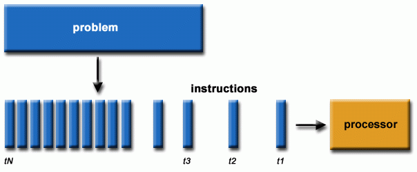
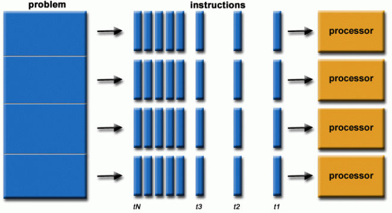
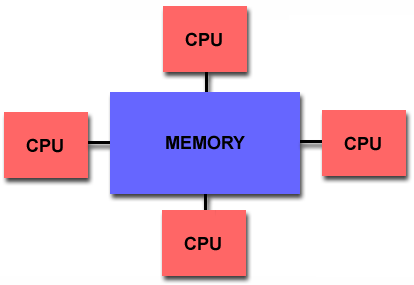
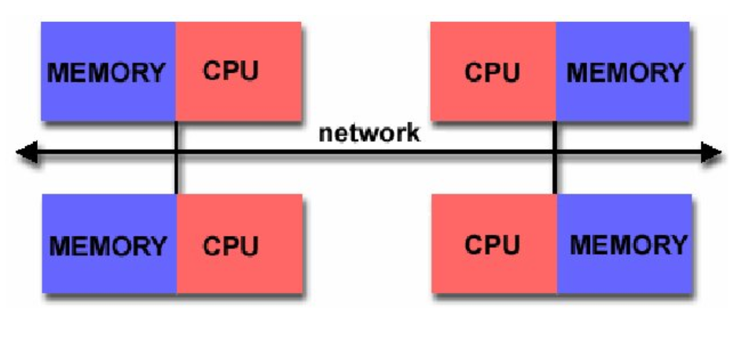

## ¿Por qué computación paralela?

Muchos problemas científicos requieren:

- ejecutar modelos muchas veces  
- explorar grandes espacios de parámetros  
- procesar grandes volúmenes de datos  


**Ejemplo:**

Simular una epidemia para 1000 combinaciones de parámetros

---

## Computación secuencial vs paralela

### Secuencial
- una tarea cada vez  

### Paralela
- múltiples tareas al mismo tiempo  


 > objetivo: reducir el tiempo total de ejecución

 ---

## Computacion Secuencial {.figure-slide}
<hr>
::: {.content} 
{width=800px}
:::

::: {.footer}
Source: https://hpc.llnl.gov/documentation
:::

---

## Computacion Paralela {.figure-slide}
<hr>
::: {.content} 
{width=800px}
:::

::: {.footer}
Source: https://hpc.llnl.gov/documentation
:::

---

## Idea clave

### Dividir un problema grande en tareas más pequeñas (HPC):

- independientes  
- ejecutables simultáneamente  

### Repetir mcuchas tareas (HTC):

- evaluar difereentes sets de parametros
- ejecutables simultáneamente  

> *divide and conquer*

---

## Paradigmas de paralelización
<hr>

::: {.columns}

::: {.column}

:::

::: {.column}

:::

:::

| Tipo | Memoria | Escalabilidad | Complejidad |
|------|--------|--------|-------------|
| Compartida | común | baja-media | baja |
| Distribuida | separada | alta | alta |

::: {.footer}
Source: https://hpc.llnl.gov/documentation
:::

---

## Memoria compartida
<hr>
- múltiples procesos/threads  
- comparten la misma memoria  
- CPU multicore
- Multiprocessing (python)

**Ventaja:**

- fácil de programar  

**Limitación:**

- escalabilidad limitada a un solo ordenador

---

## Memoria distribuida
<hr>
- múltiples nodos (máquinas)  
- cada uno con su propia memoria  
- comunicación explícita:
- MPI (Message Passing Interface)

**Ventaja**:

- alta escalabilidad  

*Limitación:*

- mayor complejidad

---


## Problemas paralelizables
<hr>
**No todos los problemas se paralelizan igual.**

### Dependencias:

- tareas independientes → fácil  
- tareas acopladas → difícil

- Problemas paralelizables:
  - Muchas operaciones independientes
- Problemas no paralelizables:
  - Dependencias fuertes entre pasos

---

## Embarrassingly parallel
<hr>
**Problemas donde:**

- las tareas son completamente independientes  
- no requieren comunicación  

---

### ❌ Problema difícil de paralelizar

**Serie de Fibonacci (recursiva clásica)**

$$
F(n) = F(n-1) + F(n-2)
$$

> Cada cálculo depende de los anteriores

- No se puede avanzar sin conocer resultados previos
- Fuerte dependencia secuencial
- No es posible paralelizar

--

## Ejemplos de paralelización (I)

### Problema fácilmente paralelizable

**Multiplicación de matrices**

Dadas dos matrices \(A\) y \(B\), cada elemento de la matriz resultado \(C\) se calcula como:

$$
C_{ij} = \sum_k A_{ik} B_{kj}
$$

Cada elemento \(C_{ij}\) se puede calcular de forma independiente

- Se pueden asignar diferentes elementos a distintos procesadores
- Muy eficiente en paralelo (GPU, HPC)

---

## Ejemplos de paralelización (II)

**Barrido de parámetros**

Cada conjunto de parámetros $p_i$ se peude evaluar de forma independiente  

- Se pueden asignar distintas simulaciones a distintos procesadores

> caso ideal para paralelización

---

## En este curso
<hr>
Ya hemos visto:

- simulaciones de epidemias  
- exploración de parámetros  

**Ejemplo:**

```python
for beta in betas:
    simular(beta)
```

---

## Problema
<hr>
Queremos explorar muchos parámetros:

- beta  
- movilidad  
- condiciones iniciales  


> el coste computacional crece rápidamente

---

## Solución
<hr>
Ejecutar simulaciones en paralelo:

- cada simulación es independiente  
- podemos distribuirlas  

> problema "embarrassingly parallel"

---

## Próximo paso
<hr>
Vamos a:

- ejecutar múltiples simulaciones  
- en paralelo  
- explorar parámetros  

---

