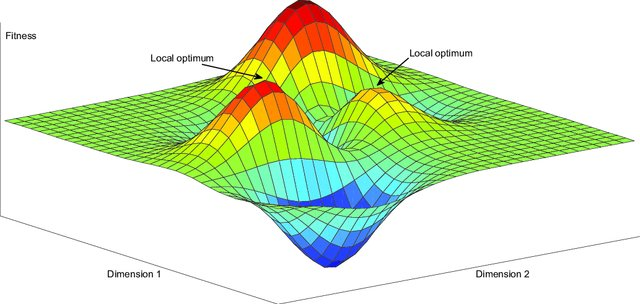
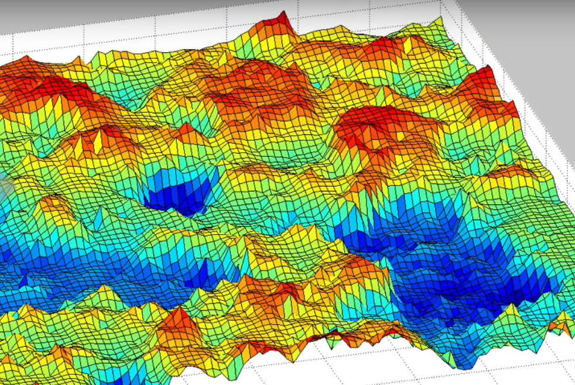
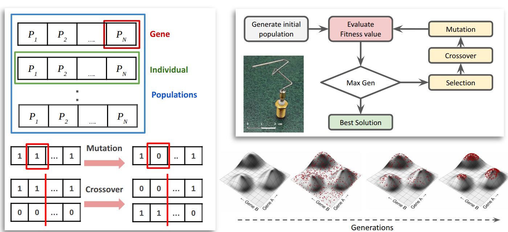
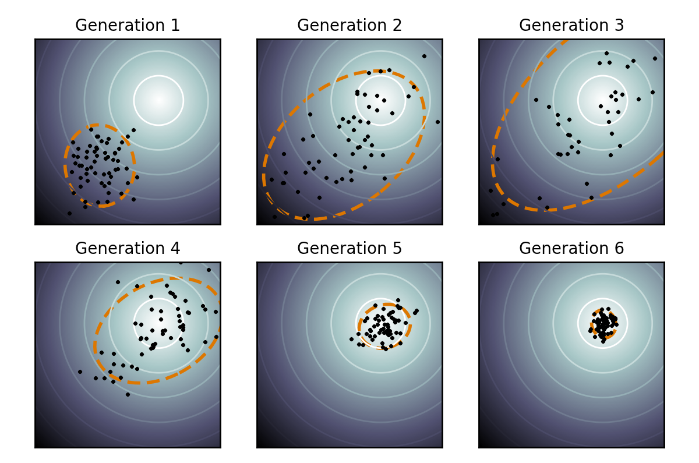

## ¿Por qué optimización?

Queremos encontrar parámetros que reproduzcan datos reales.

**Problema:**

min error(modelo, datos)

**Hasta ahora:**

- exploración manual  
- grid search  

> ¿podemos hacerlo automáticamente?

---

## Idea general

**Buscar en un espacio de parámetros:**

- beta  
- movilidad  
- condiciones iniciales  

**Evaluando:**

- qué tan bien explica los datos

---

## Optimización (I)

Paisaje adaptativo simple

::: footer
Source: Nygaard, T. F., et al (2021). Evolutionary Computation, 29(4), 441-461.
::::

---

## Optimización (II)

Paisaje adaptativo complejo

::: footer
Source: https://geo.coop/articles/landscape-co-op-development
::::

---

## Algoritmos evolutivos (I)

**Inspirados en evolución biológica**

- población de soluciones  
- selección  
- mutación  
- iteración  

**Esquema**

1. Generar soluciones aleatorias  
2. Evaluarlas  
3. Seleccionar las mejores  
4. Generar nuevas soluciones  
5. Repetir  

--- 

## Algoritmos evolutivos (II)

**Ventajas**

- no necesitan gradientes  
- funcionan con modelos complejos  
- robustos frente a ruido
- muy paralelizable

**Existen muchos tipos AE**

- Algoritmos genéticos
- Covariance Matrix Adaptation Evolutionary Strategy

---

## Algoritmos genéticos
<small>Heurística de búsqueda inspirada en la evolución por selección natural, donde se seleccionan los individuos más aptos para la reproducción con el fin de producir descendencia de la siguiente generación.</small>

---

## Covariance Matrix Adaptation Evolution Strategy
<small>Heurística de búsqueda que explora el espacio de parámetros mediante muestreo adaptativo, ajustando progresivamente una distribución probabilística hacia las soluciones más prometedoras.</small>

---

## Covariance Matrix Adaptation Evolution Strategy

**Algoritmo evolutivo avanzado:**

- muestrea parámetros  
- aprende la estructura del problema  
- adapta la búsqueda  

**Ventajas**

- no necesitan gradientes  
- funcionan con modelos complejos  
- robustos frente a ruido  

> muy eficiente en espacios continuos

---

## Conectando las distitnas piezas

**Pipeline completo**

- datos → análisis  
- modelo → simulación  
- paralelización → escala  
- optimización → calibración  