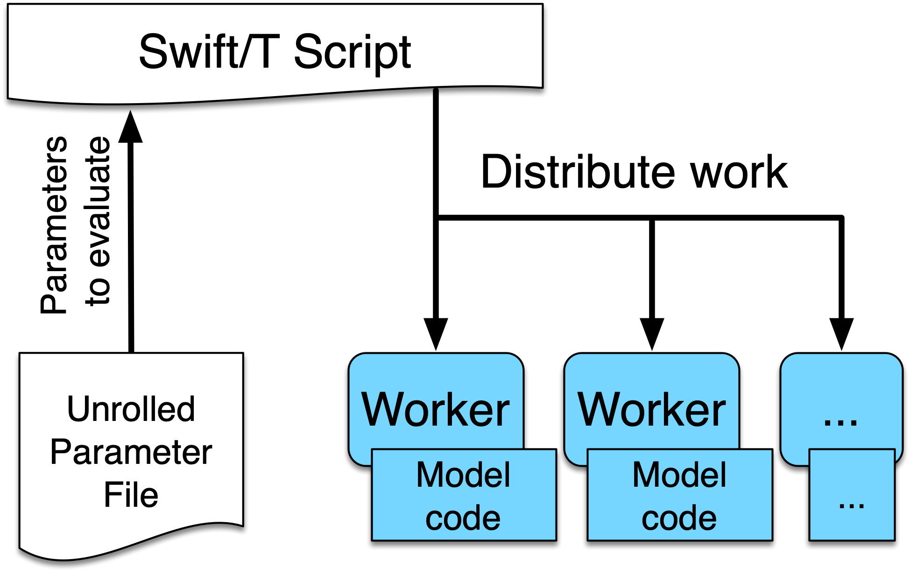
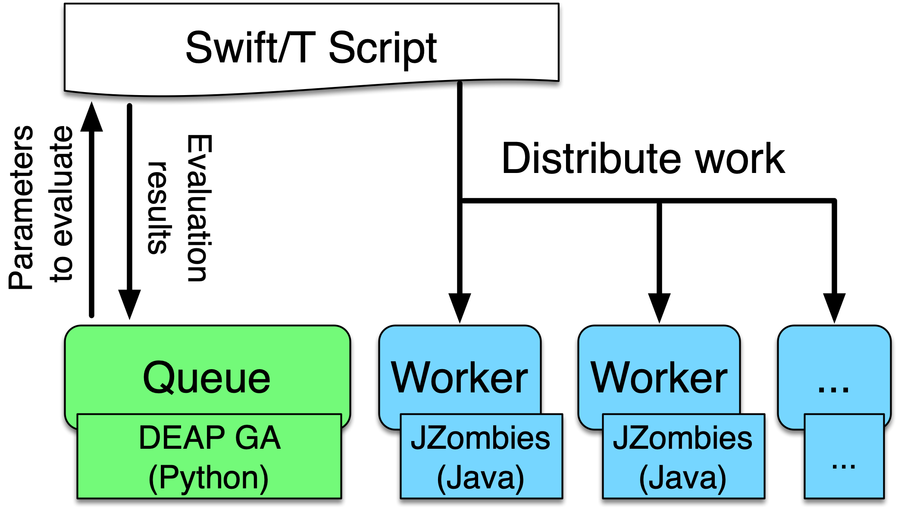

## Simple Workflows with ABM

<small>The sweep workflow reads an input file, and runs an application using each line of the input file as input to an application run. We call this input file an unrolled parameter file or UPF file. The following is the EMEWS sweep workflow structure:</small>

---

## Workflow control with Python

---