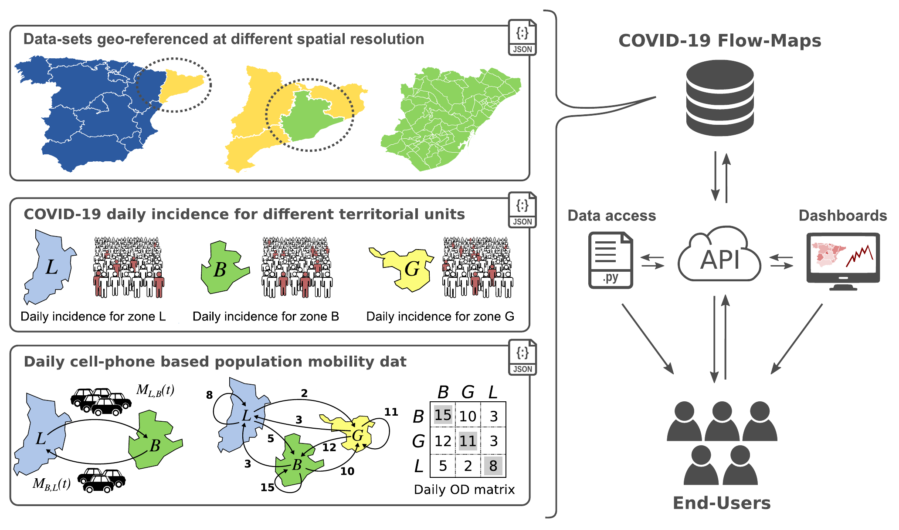
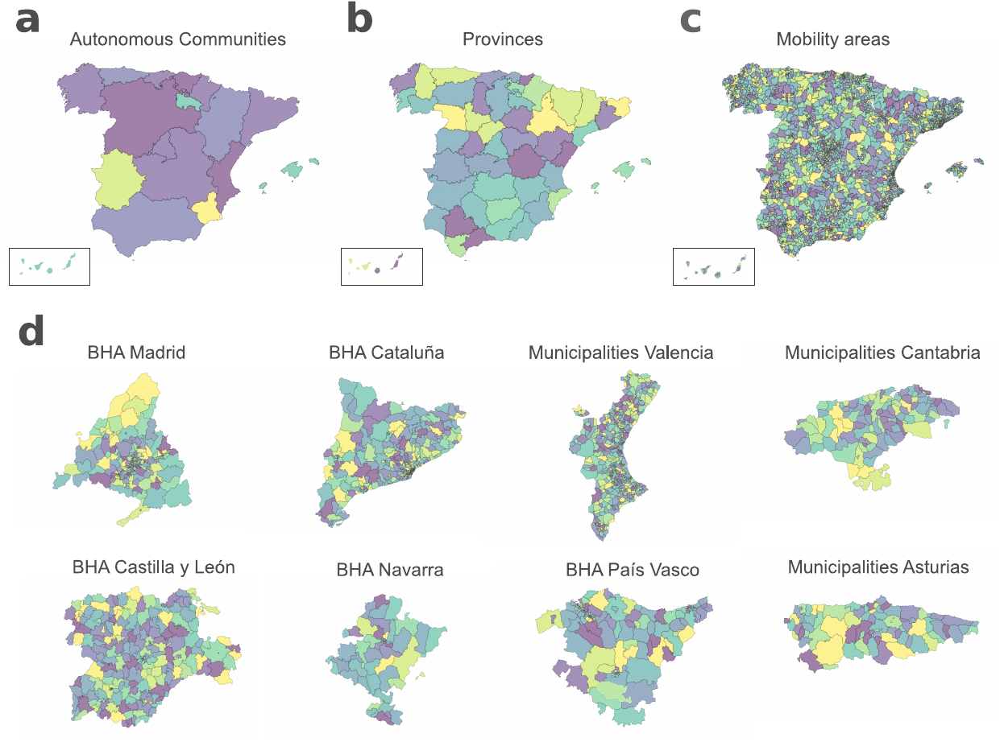
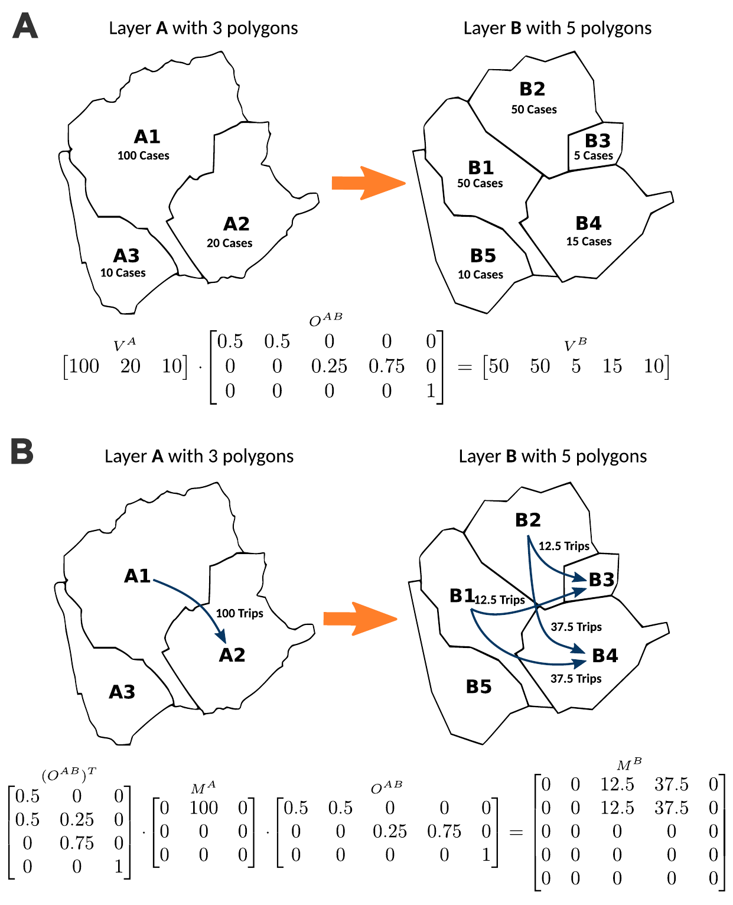
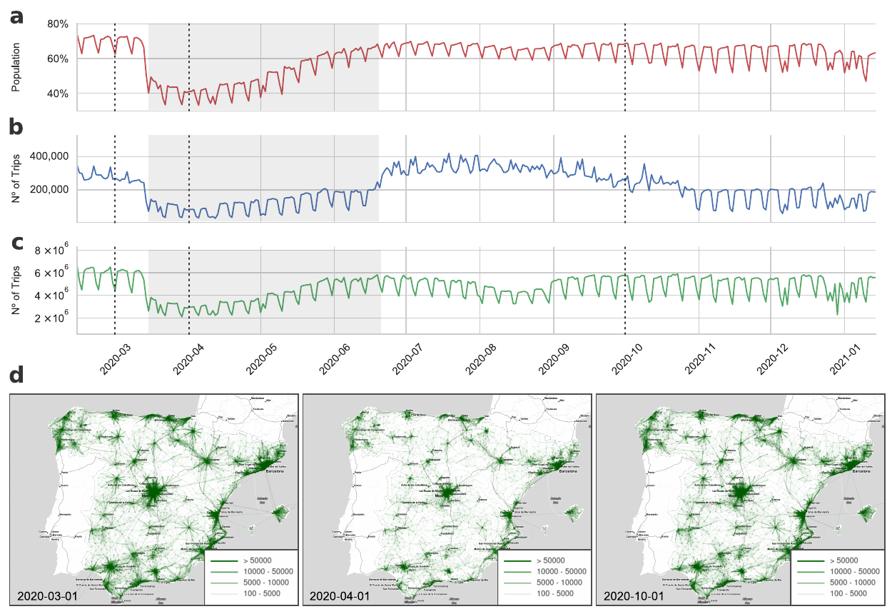
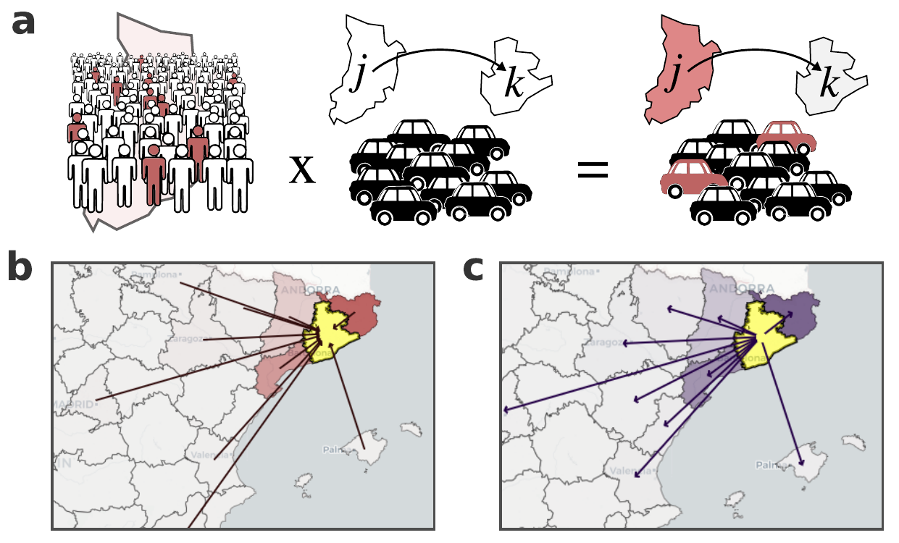

## COVID-19 Flow-Maps

- Sistema abierto de información geográfica  
- Datos de COVID-19 y movilidad en España  

🔗 https://flowmaps.life.bsc.es  
🔗 https://github.com/bsc-flowmaps

---

---

## Problema

Diferentes fuentes de datos:

- Casos de COVID  
- Movilidad poblacional  

Reportados en diferentes niveles espaciales

---

## Distintas capas geográficas {.figure-slide}

::: {.content} 

:::

---

## Datos de COVID-19

- Incidencia diaria  
- Diferentes resoluciones:
  - Provincias  
  - Comunidades autónomas  
  - Regiones sanitarias  

Heterogeneidad espacial

---

## Integración de datos {.figure-slide}

::: {.content} 

:::

---

## Datos de movilidad

- Matrices origen-destino (OD)  
- ~2850 áreas  (municipios/distritos)
- Numeros de viajes por hora entre areas
- Actividad en origen y destino    

Tipos de métricas:

- número de viajes  
- movilidad intra/inter-regional  

---

## Movilidad como red {.figure-slide}

::: {.content} 

:::

---

## Movilidad como red

- nodos → regiones  
- aristas → flujos  

Red dinámica en el tiempo

---

## Inegración: riesgo asociadao a la movilidad  {.figure-slide}

::: {.content} 

:::

---

Fin