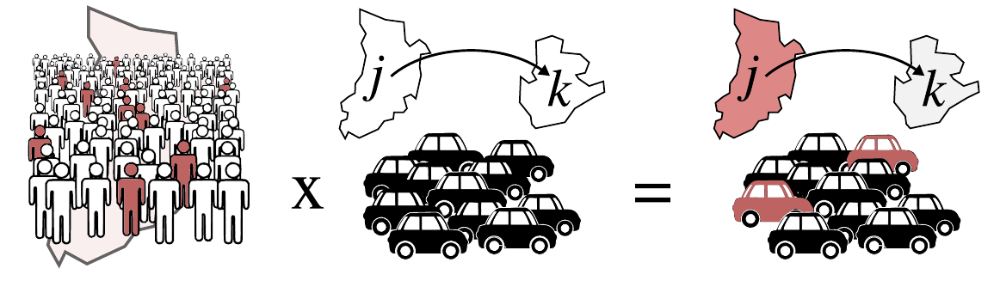

En este notebook trabajaremos con datos reales de movilidad y epidemias.

Objetivos:

- cargar datos de movilidad y covid19
- explorar estructuras
- realizar primeras transformaciones
- preparar datos para análisis
- realizar análisis básicos


# Parte I
## Datos epidemiológicos

Dataset de COVID-19 para España con:

- casos
- hospitalizaciones
- UCI
- fallecidos

Desagregado por:

- provincia
- sexo
- grupo de edad

En la celda a continuación se carga el dataset y se aplican transformaciones básica para facilitar el manejo de los datos


### Ejercicio 1 - Análisis preliminar

¿Qué representa cada fila?

**Tareas**

Investigar el dataset y responder las siguientes preguntas
1. ¿Qué dimensiones tiene el dataset?
2. ¿Por qué hay múltiples filas para la misma fecha y provincia?
3. ¿Cuantas categorías de edad hay?
4. ¿Cuantas provincias hay?
5. ¿En que rango de fechas se reportan las varialbes?


### Ejercicio 2

Filtra los datos para:

- una provincia  
- un grupo de edad  

¿Qué se observa?


## Ejercicio 3 — Serie temporal nacional

Vamos a analizar la evolución de la pandemia a nivel de toda España.

### Tareas:

1. Agrega los datos por fecha (todas las provincias)
2. Calcula las siguientes variables:
   - casos
   - hospitalizaciones
   - UCI
   - fallecimientos
3. Representa las 4 variables en subplots

¿Qué patrón observas en las curvas?

**Ayuda**
Para la agregación emplear un `groupby` "date" y sumar en las varaiables de interés: "cases", "hosp", "uci", "deaths" y guardar el resultado en una variable llamada `covid_spain`

Para realizar los plots:
`fig, axes = plt.subplots(2, 2, figsize=(12, 6), sharex=True)`
Para realizar los distintos gráficos usar el comando de ejemplo modificando la variable de interes (casos, hosp, etc) y los índices de la varable axes:
`covid_spain["cases"].plot(ax=axes[0, 0], title="Casos por día")`


## Ejercicio 4 — Patrón semanal

Observa las series temporales.

### Preguntas:

- ¿Las curvas son suaves?
- ¿Observas algún patrón repetitivo?
- ¿A qué crees que se debe?

Pista: piensa en cómo se reportan los datos


## Ejercicio 5 — Media móvil (rolling average)

Para eliminar el efecto del reporte semanal:

### Tareas:

1. Calcula una media móvil de 7 días
2. Representa la serie original vs suavizada

¿Qué cambia?

**Ayuda**

Emplear la función `rolling(window=wsize)` con `wsize=7`


## Ejercicio 6 — Suavizado por provincia (*)

Aplica el suavizado a nivel provincial.

### Tareas:

1. Agrupa por provincia y fecha
2. Aplica rolling average de 7 días por provincia

Pista: usa groupby + transform o apply


## Ejercicio 7 — Visualización por provincias

Vamos a visualizar la evolución temporal en todas las provincias.

### Tareas:

1. Crear un grid de subplots
2. Representar la serie suavizada por provincia

¿Observas diferencias entre provincias?
¿Se sincronizan las olas?

¿Qué provincias presentan mayor incidencia?


Identificar los picos y las fechas en cada provincia


## Ejercicio 8 — Ranking de casos acumulados

Vamos a identificar las provincias con mayor impacto de la pandemia.

### Tareas:

1. Calcula los casos acumulados por provincia  
2. Construye un ranking (de mayor a menor)  

¿Qué provincias aparecen arriba?


## Ejercicio 9 — Interpretación

Observa el ranking anterior.

### Preguntas:

- ¿Es correcto comparar directamente estos valores?
- ¿Qué factores pueden influir en este ranking?

Pista: piensa en el tamaño de las provincias

## Ejercicio 10 — Integración de datos

Disponemos de datos de población por provincia.

### Tareas:

1. Cargar el dataset de población `covid19/provincias.parquet` usando `geopandas` 
2. Hacer un merge con los datos de COVID
3. Dividir la columna de casos por la te población (`total`) y multiplicar por 1e5 (100K)
4. Hacer el ranking y comparar con el ranking previo
5. Representar los caseos escalados en un mapa

Pista: usa el identificador de provincia


## Ejercicio 11 — Incidencia escalada (*)

Parte 1. Agregar los casos diarios por provincia y fecha.
Parte 2. Aplicar una media deslizante con una ventana de 7 días para remover el efecto del reporte semana y guardar el resultado en una nueva variable.
Parte 3. Hacer un merge con los datos de población y calcular los casos cada 100.000 habitantes

# Parte II
## Analisis de datos de movilidad

En esta segunda parte trabajaremos con datos de movilidad poblacional basados en telefonía móvil

Estos datos describen el número de viajes entre 2850 zonas geográficas en España que corresponden a distritos o municipios

El objetivo de esta parte es:

- entender la estructura de los datos de movilidad  
- transformar los datos en una representación más manejable  
- construir flujos agregados entre regiones  
- analizar la movilidad como una red 

## Carga de datos

Cargamos los datos de movilidad.


## Exploración inicial

Vamos a inspeccionar las columnas del dataset.


## Ejercicio 1

¿Cuantas entradas tiene el dataframe?
¿Qué representa cada fila del dataset?

Pistas:
- Observa que hay varias filas con el mismo origen y destino  
- ¿Qué variables cambian entre ellas?  
- ¿Qué significa esto en términos de datos? 


## Limpieza y estandarización

Renombramos columnas para facilitar el análisis.


## Ejercicio 2

¿Cuántas combinaciones únicas de origen-destino hay?

¿Es un dataset pequeño o grande?


## Ejercicio 3 (*)

### Agregación de datos

Queremos construir el flujo total entre regiones.

Para ello, agregamos todas las filas que corresponden a un mismo:
- origen  
- destino  
- fecha  

¿Qué problema estamos resolviendo?


## Ejercicio 4 (*)
### Construcción de matriz OD

Construimos la matriz origen-destino (ODM), una matriz cuadrada donde cada entrada $x_{ij}$ representa el total de viajes desde la reigón $i$ a la región $j$ 

Pista: hay que hacer un pivot de la tabla

¿Qué representa esta matriz?

- ¿Qué son las filas?  
- ¿Qué son las columnas?  
- ¿Qué representan los valores?  

Analizar qué regiones reciben más movilidad.


## Ejercicio 5 — Matriz origen-destino

Construye un heatmap de la matriz OD.

### Tareas:

1. Construir la matriz OD  
2. Visualizar con seaborn  (heatmap)


## Ejercicio 6

Analiza la distribución de la variable `flow` (viajes):

- ¿Es uniforme?
- ¿Hay valores extremos?
- ¿Qué tipo de distribución tiene?

Identifica los flujos más importantes:

- ¿Qué pares origen-destino tienen más viajes?


## Ejercicio 7 — Viajes internos

Los viajes internos son aquellos en los que el origen y el destino coinciden.

### Tareas:

1. Filtra los viajes internos  
2. Calcula el número total de viajes internos por región  
3. Identificar las 10 regiones con mayor numero de viajes internos
4. Representar en un mapa los viajes internos


## Ejercicio 8 — Movilidad saliente

La movilidad saliente mide el número total de viajes que salen de cada región.

### Tareas:

1. Agrupa los datos por origen  
2. Calcula el total de viajes  
3. Identificar las 10 regiones con mayor numero de viajes
4. Representar en un mapa los flujos salientes


## Ejercicio 9 — Movilidad entrante

La movilidad entrante mide el número total de viajes que llegan a cada región.

### Tareas:

1. Agrupa los datos por destino  
2. Calcula el total de viajes  
3. Identificar las 10 regiones con mayor numero de viajes
4. Representar en un mapa los flujos entrantes


## Ejercicio 10 — Comparación

Compara:

- viajes internos  
- movilidad entrante  
- movilidad saliente  

### Pregunta:

¿Qué diferencias observas entre regiones?


## Ejercicio 11 — Visualización geográfica

Vamos a visualizar la movilidad sobre un mapa.

### Tareas:

1. Cargar la geometría (`data/mitma_v1/zonificacion.parquet`)
2. Calcular los viajes totales/internos/externos por región
3. Unir vaijes totales con las geometrías
3. Representar en un mapa


## Ejercicio 11 — Agregación a nivel provincial (*)

Hasta ahora hemos trabajado a nivel de zonas de movilidad (alta resolución).

En este ejercicio vamos a **agregar los viajes a nivel de provincias**.

Disponemos de un `GeoDataFrame` (`gdf`) que contiene:

- `zone_id` → identificador de la zona (ej. 01001_AM)  
- `province_id` → identificador de la provincia  

---

### Objetivo

Construir una matriz de movilidad entre provincias.

---

### Tareas

1. Asignar a cada fila del dataset de movilidad:
   - la provincia de origen  
   - la provincia de destino  

2. Agregar los flujos:
   - por provincia de origen y destino  

---

### Pistas

- Necesitarás hacer **dos merges**:
  - uno sobre `origin`
  - otro sobre `destination`

- Después:
  - agrupa por provincia  
  - suma los flujos  

---

### Preguntas:

- ¿Qué diferencias observas respecto a la matriz original?  
- ¿Qué información se pierde al agregar?


## Ejercicio final — Riesgo asociado a la movilidad (*)



En este ejercicio vamos a combinar:

- datos epidemiológicos (COVID-19)
- datos de movilidad

para construir un indicador simple del riesgo de propagación.

---

## Idea

Queremos estimar:

cuántas personas infectadas se están desplazando entre regiones

---

## Aproximación

1. Estimar el número de personas infectadas por región  
2. Convertirlo en una densidad (probabilidad de estar infectado)  
3. Combinarlo con los flujos de movilidad  

---

**Nota:**

Este indicador es una simplificación, ya que asumimos que:

- la probabilidad de viajar es independiente del estado de infección

Aun así, es un indicador útil para combinar datos de distinta naturaleza.

## Paso 1 — Incidencia acumulada a 10 días

Vamos a usar la suma de casos en los últimos 10 días como una aproximación del número de personas infectadas.

### Tareas:

1. Trabajar con los datos agregados por:
   - fecha
   - provincia  

2. Calcula la incidencia acumulada a 10 días usando una suma móvil.

Esto será nuestro proxy de infectados

**Ayuda**: aplicar la misma estrategia que en el ejercicio 6 para aplicar la media deslizante


## Paso 2 — Densidad de infectados

Para comparar entre regiones necesitamos normalizar por población.

### Tareas:

1. Combinar con el dataset de población  
2. Calcula la densidad de infectados como:

densidad = cases_10d / total_population


## Paso 3 — Selección temporal

Selecciona un día concreto para el análisis (ver ejemplo a continuación).
```python
d = pd.to_datetime("2020-03-31")
covid_pop[covid_pop["date"] == d]
```


## Paso 5 — Cálculo del riesgo

Queremos combinar:

- trips(date, source, target)
- density(date, id)

Calcula:

risk = trips × density


## Paso 6 — Agregación

Calcula:

- riesgo total saliente por región
- riesgo total entrante por región


